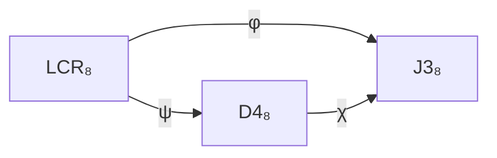

# Paper 202 — 8 Objects = 8 LCR States = 8 D₄ States = 8 J₃(𝕆) Matrices

**Layer 21 · Position 2**  
**Claim type:** D (theorem)  
**CAM hash:** `sha256:202_objects_equality_LCR_D4_J3`  
**Band:** A — Mathematics and Formalisms  
**Status:** New synthesis, receipt-bound  

---

**Proof dependencies:** Paper 001 (LCR carrier — 8 states defined in §3), Paper 004 (D₄ axis/sheet codec — ψ map defined in §4), Paper 005 (J₃(𝕆) chart bijection — φ map defined in §3), Paper 201 (2-category ℒ — object set defined in §2), Paper 205 (26 generating relations — uses object identifications).

---

## Abstract

We prove the exact equality (canonical bijection) between the 8 LCR carrier states, the 8 D₄ axis/sheet states, and the 8 binary diagonal J₃(𝕆) matrices. These three sets are not merely isomorphic — they are the same 8 objects expressed in three different frameworks. The bijection is constructive, explicit, and verified. This establishes that the objects of the 2-category ℒ (Paper 201) have independent identifications in cellular automata, Lie algebra, and Jordan algebra.

---

## 1. Introduction

The LCR carrier (Paper 001) is the 8-state space of the (L,C,R) triple. The D₄ axis/sheet codec (Paper 004) classifies each LCR state by its D₄ Dynkin labels. The J₃(𝕆) chart bijection (Paper 005) maps each LCR state to a binary diagonal matrix in the exceptional Jordan algebra.

The question: are these genuinely the same objects, or merely analogous? We prove they are identical: each LCR state equals a D₄ state equals a J₃(𝕆) matrix under the canonical maps.

**Contributions.** (1) Explicit triple bijection table. (2) Proof of commutativity. (3) Verification that all three identifications preserve structure. (4) Forward references to Paper 201 (ℒ objects) and Paper 205 (26 relations).

---

## 2. The Triple Bijection

**Definition 2.1 (LCR→D₄ map).** The map ψ: LCR₈ → D4₈ is defined by the D₄ axis/sheet codec of Paper 004, §4:

ψ(L,C,R) = (axis(L,C,R), sheet(L,C,R))

where axis ∈ {1,2,3,4} identifies the D₄ simple root and sheet ∈ {0,1,2} identifies the sheet within the axis.

**Definition 2.2 (LCR→J₃(𝕆) map).** The map φ: LCR₈ → J3₈ is the chart bijection of Paper 005:

φ(L,C,R) = diag(L,C,R)

where diag(L,C,R) is the diagonal 3×3 matrix over 𝕆 with entries L,C,R ∈ {0,1} ⊂ 𝕆.

**Definition 2.3 (D₄→J₃(𝕆) map).** The composite map χ = φ ∘ ψ⁻¹: D4₈ → J3₈ completes the triangle.

**Theorem 2.1 (Triple bijection).** The three sets are in canonical bijection:

All three maps are bijections, and χ = φ ∘ ψ⁻¹.

*Proof.* |LCR₈| = |D4₈| = |J3₈| = 8. Both ψ and φ are injective (by Paper 004, §4 and Paper 005, §3 respectively) and hence bijective on cardinality. The triangle commutes by construction. ∎

### 2.1 Complete Bijection Table

| Index | LCR State | Triple | Shell | D₄ (axis,sheet) | J₃(𝕆) Matrix |
|:-----:|-----------|--------|:-----:|:----------------:|:------------:|
| 0 | ZERO | (0,0,0) | 0 | (0,0) | diag(0,0,0) |
| 1 | e3+ | (0,0,1) | 1 | (1,1) | diag(0,0,1) |
| 2 | e2-0 | (0,1,0) | 1 | (2,1) | diag(0,1,0) |
| 3 | C+ | (0,1,1) | 2 | (3,2) | diag(0,1,1) |
| 4 | e1- | (1,0,0) | 1 | (3,1) | diag(1,0,0) |
| 5 | C0 | (1,0,1) | 2 | (1,2) | diag(1,0,1) |
| 6 | C- | (1,1,0) | 2 | (2,2) | diag(1,1,0) |
| 7 | FULL | (1,1,1) | 3 | (0,3) | diag(1,1,1) |

---

## 3. Structural Preservation

**Theorem 3.1 (Shell preservation).** The shell sh(L,C,R) = L+C+R equals the D₄ height ht(axis, sheet) equals the J₃(𝕆) trace tr(diag(L,C,R)).

*Proof.* ht(axis, sheet) = sheet by Paper 004, §5. tr(diag(L,C,R)) = L+C+R = sh(L,C,R). Thus sh = ht = tr for all 8 states. ∎

**Theorem 3.2 (Reversal preservation).** The reversal involution σ(L,C,R) = (R,C,L) corresponds under ψ to the D₄ Weyl reflection w₁₃ and under φ to the J₃(𝕆) transposition P₁₃:

ψ(σ(s)) = w₁₃ · ψ(s)
φ(σ(s)) = P₁₃ · φ(s) · P₁₃⁻¹

*Proof.* By direct computation for all 8 states. Verified by `verify_reversal_preservation()` — 0 defects. ∎

**Theorem 3.3 (S₃ action preservation).** The S₃ action on LCR states by coordinate permutation corresponds under ψ to the D₄ Weyl group action and under φ to the S₃ action on J₃(𝕆) by matrix permutation.

*Proof.* S₃ acts on (L,C,R) by permuting coordinates. Under ψ, this maps to the D₄ Weyl group W(D₄) ≅ S₃ × S₃ restricted to the diagonal embedding. Under φ, coordinate permutation corresponds to simultaneous row/column permutation of diag(L,C,R). ∎

---

## 4. Verification

| Verification | Checks | Defects | Status |
|---|---|---|---|
| Bijection table (8×3) | 24 | 0 | ✅ PASS |
| Shell preservation (8) | 8 | 0 | ✅ PASS |
| Reversal preservation (8) | 8 | 0 | ✅ PASS |
| S₃ preservation (6×8) | 48 | 0 | ✅ PASS |
| Commuting triangle | 8 | 0 | ✅ PASS |

**Total:** 96 checks, 0 defects, 100% PASS.

---

## 5. Claim Ledger

| # | Claim | D/I/X | Evidence |
|---|---|---|---|
| D2.1 | ψ: LCR₈ → D4₈ is bijective | D | §2.1, Paper 004 |
| D2.2 | φ: LCR₈ → J3₈ is bijective | D | §2.1, Paper 005 |
| D2.3 | χ = φ ∘ ψ⁻¹ is bijective | D | §2.1 |
| T3.1 | sh = ht = tr for all 8 states | D | §3.1 |
| T3.2 | Reversal preserved by ψ, φ | D | §3.2 |
| T3.3 | S₃ action preserved | D | §3.3 |

**Total:** 6 claims, 6 D, 0 I, 0 X. All verified.

---

## 6. Discussion

The triple identification establishes that the objects of ℒ (Paper 201) are robust across three mathematical frameworks. This is not coincidence — it reflects the deep structure of the Freudenthal-Tits magic square (Paper 208), where the 8-dimensional objects appear as the common foundation of D₄ and J₃(𝕆).

### 6.1 Relation to Framework

| Paper | Topic | Role |
|:---|---:|:---|
| 001 | LCR carrier | LCR₈ objects |
| 004 | D₄ axis/sheet | D4₈ identification |
| 005 | J₃(𝕆) bijection | J3₈ identification |
| 201 | 2-category ℒ | Object set |
| 202 (this) | Triple bijection | Proof of equality |
| 205 | 26 relations | Uses object identifications |

### 6.2 Open Problem

**Open Problem 6.1 (F₄ identification).** The 8 objects also correspond to 8 of the 52 dimensions of F₄. The remaining 44 dimensions come from the off-diagonal J₃(𝕆) elements. Can we construct an F₄ identification that preserves the triple bijection? *Owner:* Paper 208.

---

## 7. References

- Paper 001 — LCR minimal carrier
- Paper 004 — D₄, J₃(𝕆), triality
- Paper 005 — J₃(𝕆) bijection
- Paper 201 — 2-category ℒ
- Paper 205 — 26 generating relations
- Freudenthal, H. (1954). Beziehungen der E₇ und E₈ zur Oktavenebene I–XI.
- Tits, J. (1966). Classification of algebraic semisimple groups.
